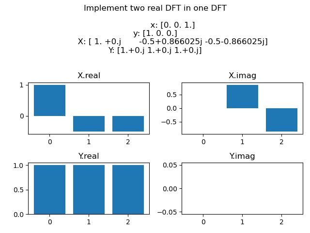
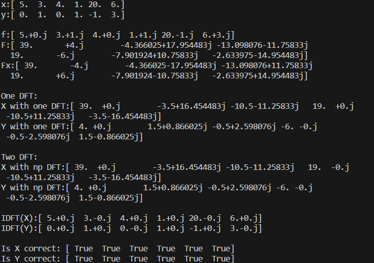

# Two Real DFT In One DFT
f = x + iy 

x = (f+fx)/2 

y = (f-fx)/2i

X = (F+Fx)/2 

Y = (F-Fx)/2i

## Install Environment
```
pip install numpy argparse matplotlib
```

## Execute
```
python main.py # default
```
```
python main.py {--x list of real number} {--y list of real number}
```
```
python main.py --x 5 3 4 1 20 6 --y 0 1 0 1 -1 3
```

## Results

Compare one DFT with two DFT:

